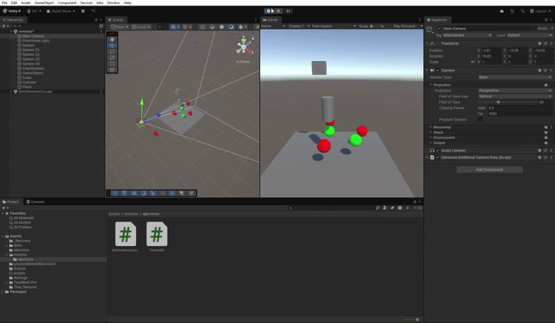
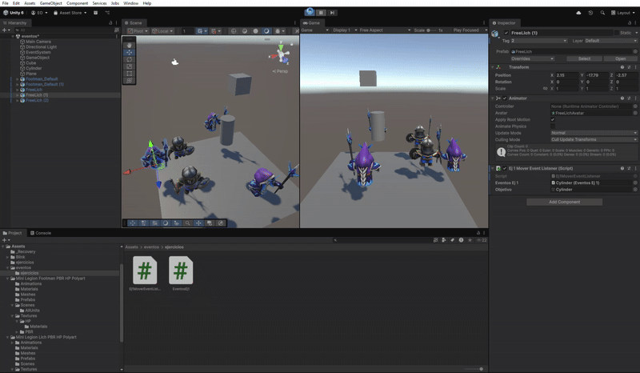
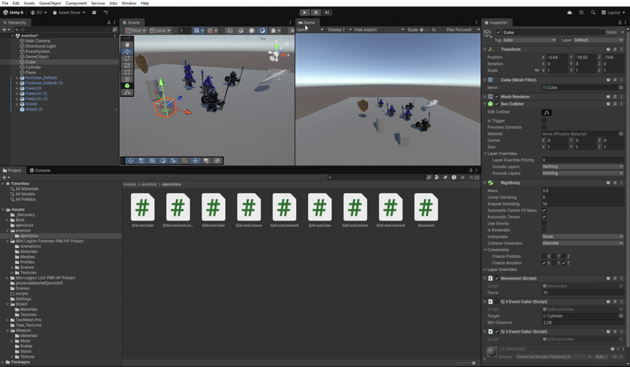
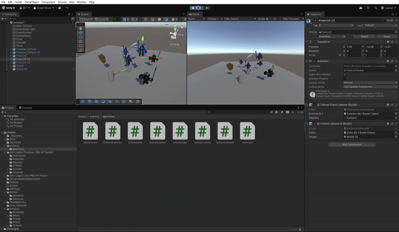
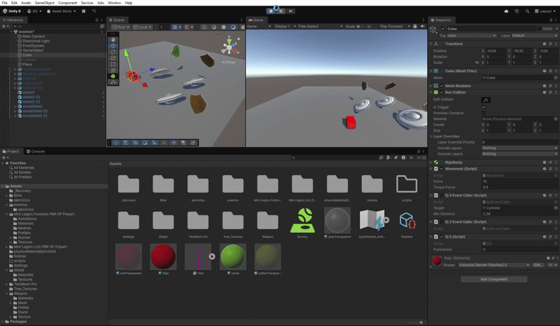
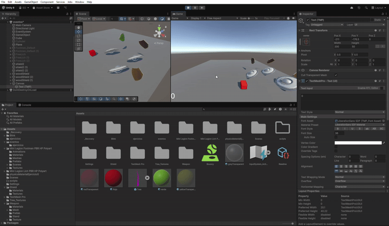
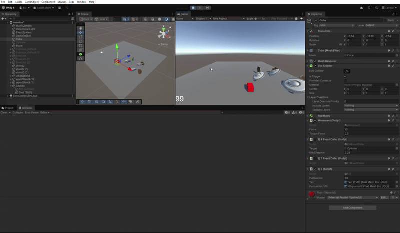
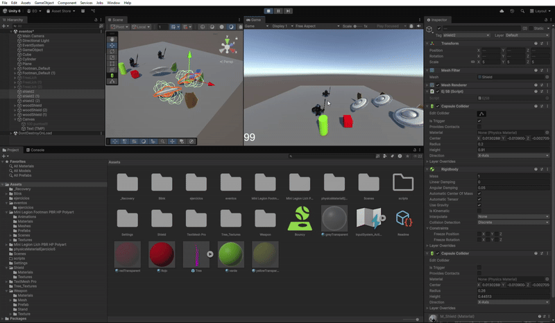

# Proyecto de Mecánicas de Movimiento y Puntuación

Este proyecto implementa varias mecánicas de interacción entre objetos y humanoides en Unity, incluyendo colisiones, movimiento dirigido, teletransportación, recolección de escudos y actualización de puntuación en la UI.

---

## Ejercicio 1 — Colisión y movimiento por evento

### Descripción
Escena con:
- 3 esferas rojas etiquetadas como **Tipo 1**  
- 2 esferas verdes etiquetadas como **Tipo 2**  
- Un **Cubo**  
- Un **Cilindro**

Cuando el **Cubo** colisiona con el **Cilindro**, este emite un evento.  
Las esferas están suscritas a ese evento y se mueven hacia su objetivo:
- Las **Tipo 1** avanzan hacia una esfera verde fijada.  
- Las **Tipo 2** se dirigen al cilindro.

### Scripts
- **Ej1EventCaller.cs**: asignado al cilindro.  
- **Ej1MoverEventListener.cs**: asignado a las esferas.

### Configuración en la escena
1. Asignar **Ej1EventCaller** al cilindro.  
2. Asignar **Ej1MoverEventListener** a cada esfera.  
3. Vincular en cada esfera el cilindro como objeto de evento y su objetivo.  
4. Etiquetar el cubo como `"cubo"`.

### Resultado
Al colisionar el cubo con el cilindro:
- Las esferas **Tipo 1** se desplazan hacia la esfera verde fijada.  
- Las esferas **Tipo 2** se mueven hacia el cilindro.

---

## Ejercicio 2 — Humanoides y escudos (sin script)

### Descripción
- Humanoides tipo 1 y 2 reemplazan las esferas.  
- Diferentes tipos de escudos (tipo 1 y 2).  
- Cuando el cubo colisiona con un humanoide:
  - Si es **Tipo 2**, los humanoides del grupo 1 se acercan a un escudo seleccionado.  
  - Si es **Tipo 1**, los humanoides del grupo 2 se dirigen a escudos físicos.  
- Colisión con escudos cambia el color de los humanoides.

---

## Ejercicio 3 — Teletransportación y orientación de humanoides

### Descripción
- Humanoides de dos tipos y objetos de referencia para cada grupo.  
- Colisión del cubo:
  - Con **Tipo 2** → humanoides del grupo 1 se mueven al **escudo objetivo**.  
  - Con **Tipo 1** → humanoides del grupo 2 se orientan hacia un **objeto de referencia**.

### Scripts
- **Ej3EventCaller.cs**: asignado al cubo.  
- **Ej3EventListener.cs**: grupo 1.  
- **Ej3EventListenerB.cs**: grupo 2.

### Configuración
1. Cubo con **Ej3EventCaller** y humanoides etiquetados `"1"` o `"2"`.  
2. Grupo 1 con **Ej3EventListener** vinculado a escudo objetivo.  
3. Grupo 2 con **Ej3EventListenerB** vinculado a objeto de referencia.

### Resultado
- Grupo 1 se teletransporta al escudo.  
- Grupo 2 se orienta hacia el objeto de referencia.

---

## Ejercicio 4 — Recolectar escudos y puntuación

### Descripción
- Escudos tipo 1 suman 5 puntos; tipo 2 suman 10.  
- La puntuación se muestra en la consola.  
- Al acercarse el cubo a un escudo, los objetos asignados:
  - Se teletransportan al escudo.  
  - Se orientan hacia él.

### Scripts
- **Ej4EventCaller.cs**: cubo.  
- **Ej4EventListener.cs**: teletransportación.  
- **Ej4EventListenerB.cs**: orientación.

### Configuración
1. Cubo con **Ej4EventCaller** y distancia mínima al escudo.  
2. Objetos con **Ej4EventListener** y **Ej4EventListenerB** según su comportamiento.

### Resultado
- Objetos se teletransportan u orientan al escudo al acercarse.  
- Puntuación se actualiza en la consola.

---

## Ejercicio 5 — Interfaz de puntuación y recompensas

### Descripción
- Puntuación mostrada en la UI con **TextMeshProUGUI**.  
- Escudos incrementan la puntuación:
  - Tipo 1 → +5 puntos  
  - Tipo 2 → +10 puntos  
- Cada 100 puntos activa un objeto de recompensa en la UI.

### Scripts
- **Ej5.cs**: cubo, actualización de puntuación y activación de recompensa.  
- **Ej5B.cs**: escudos destruidos al ser recogidos.

### Configuración
1. Cubo con **Ej5.cs**, vinculando UI de puntuación y recompensa.  
2. Escudos con **Ej5B.cs**, etiquetados `"shield1"` o `"shield2"`.  
3. Objeto de recompensa inicialmente desactivado.

### Resultado
- Puntuación visible en la UI.  
- Cada 100 puntos se activa la recompensa.  
- Escudos desaparecen al ser recogidos.

---

## Ejercicio 6 — Mecánica de recompensa por puntos (sin script)

### Descripción
- Cada 100 puntos obtenidos por el cubo activa una recompensa en la interfaz.  
- Muestra visual de la recompensa en la UI.

---

## Ejercicio 7 — Escena prototipo con mecánicas anteriores (sin script)

### Descripción
- Escena que integra varias de las mecánicas previas.  
- Cubo interactúa con humanoides, escudos y objetos de referencia.  
- Se observan movimientos, teletransportaciones y actualizaciones de puntuación.

---

## Ejercicio 8 — Cubo como objeto físico (sin script)

### Descripción
- Implementa el ejercicio 3 (teletransportación y orientación) pero considerando que el cubo es un objeto físico.  
- Mecánica de colisiones y eventos intacta, adaptada a Rigidbody.

